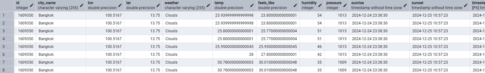
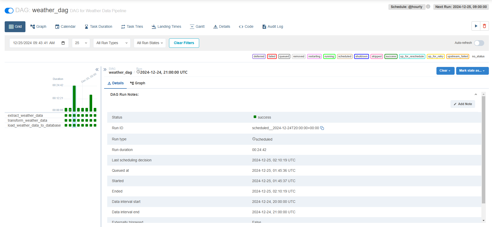

# 🌤️ Weather Data ETL Pipeline with Automation

This project demonstrates a fully automated ETL pipeline designed to extract, transform, and load real-time weather data for Bangkok. The pipeline leverages **Apache Airflow** for workflow orchestration, **Docker** for containerization, and **PostgreSQL** for structured data storage and querying.

## 🛠️ Features
- **Real-time Data Extraction**: Retrieves real-time weather data from a public API.
- **ETL Workflow Automation**: Automates the extraction, transformation, and loading processes with Apache Airflow.
- **Containerized Environment**: Uses a custom Docker image with Apache Airflow and PostgreSQL pre-configured for seamless deployment.
- **Scalable and Fault-tolerant**: Designed to handle continuous data ingestion and adapt to future data source integrations.
- **Optimized Database Design**: Stores data in PostgreSQL using an efficient schema for querying and analysis.
- **Data Quality Checks**: Ensures the accuracy and reliability of ingested data through validation steps.

## 🏗️ Architecture


1. **Data Extraction**: The pipeline fetches data from the weather API at regular intervals.
2. **Data Transformation**: Applies cleaning and transformation logic to standardize the data.
3. **Data Loading**: Loads the transformed data into a PostgreSQL database for long-term storage and querying.
4. **Orchestration**: Apache Airflow handles task scheduling, dependencies, and monitoring.

## ⚙️ Technologies Used
- **Programming Language**: Python
- **Workflow Orchestration**: Apache Airflow
- **Database**: PostgreSQL
- **Containerization**: Docker
- **API**: Weather API (e.g., OpenWeatherMap or similar)

## 🚀 How to Run the Project
### Prerequisites
1. Install [Docker](https://www.docker.com/get-started).
2. Clone this repository:
   ```bash
   git clone https://github.com/your-username/weather-etl-pipeline.git
   cd weather-etl-pipeline
   ```

### Steps
1. **Build the Docker Image**:
   ```bash
   docker-compose build
   ```
2. **Start the Services**:
   ```bash
   docker-compose up
   ```
3. **Access Apache Airflow**:
   Open your browser and navigate to `http://localhost:8080` to monitor workflows.

4. **Access PostgreSQL**:
   Connect to the database using your preferred SQL client or via the terminal.

### Environment Variables
Create a `.env` file to store your API key and database credentials:
```env
API_KEY=your_api_key
DB_USER=postgres
DB_PASSWORD=your_password
DB_HOST=localhost
DB_PORT=5432
DB_NAME=weather_data
```

## 🔧 Future Enhancements
- Integrate additional APIs for richer data sources.
- Add visualization tools like Metabase or Tableau for real-time analytics.
- Implement machine learning models for weather trend predictions.

## Snapshot of Result Data

